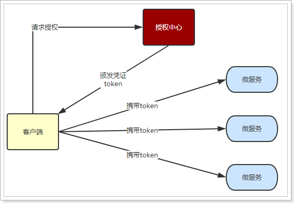

# 1.无状态登录原理

## 1.1.什么是有状态？

有状态服务，即服务端需要记录每次会话的客户端信息，从而识别客户端身份，根据用户身份进行请求的处理，典型的设计如tomcat中的session。

例如登录：用户登录后，我们把登录者的信息保存在服务端session中，并且给用户一个cookie值，记录对应的session。然后下次请求，用户携带cookie值来，我们就能识别到对应session，从而找到用户的信息。

缺点是什么？

- 服务端保存大量数据，增加服务端压力
- 服务端保存用户状态，无法进行水平扩展
- 客户端请求依赖服务端，多次请求必须访问同一台服务器

## 1.2.什么是无状态

微服务集群中的每个服务，对外提供的都是Rest风格的接口。而Rest风格的一个最重要的规范就是：服务的无状态性，即：

- 服务端不保存任何客户端请求者信息
- 客户端的每次请求必须具备自描述信息，通过这些信息识别客户端身份

带来的好处是什么呢？

- 客户端请求不依赖服务端的信息，任何多次请求不需要必须访问到同一台服务
- 服务端的集群和状态对客户端透明
- 服务端可以任意的迁移和伸缩
- 减小服务端存储压力

## 1.3.如何实现无状态

无状态登录的流程：

- 当客户端第一次请求服务时，服务端对用户进行信息认证（登录）
- 认证通过，将用户信息进行加密形成token，返回给客户端，作为登录凭证
- 以后每次请求，客户端都携带认证的token
- 服务的对token进行解密，判断是否有效。

流程图：

整个登录过程中，最关键的点是什么？

**token的安全性**

token是识别客户端身份的唯一标示，如果加密不够严密，被人伪造那就完蛋了。

采用何种方式加密才是安全可靠的呢？

我们将采用`JWT + RSA非对称加密`

## 1.4.JWT

### 1.4.1.简介

JWT，全称是Json Web Token， 是JSON风格轻量级的授权和身份认证规范，可实现无状态、分布式的Web应用授权；官网：https://jwt.io

GitHub上jwt的java客户端：https://github.com/jwtk/jjwt

### 1.4.2.数据格式

JWT包含三部分数据：

- Header：头部，通常头部有两部分信息：

    - 声明类型，这里是JWT

  我们会对头部进行base64编码，得到第一部分数据

- Payload：载荷，就是有效数据，一般包含下面信息：

    - 用户身份信息（注意，这里因为采用base64编码，可解码，因此不要存放敏感信息）
    - 注册声明：如token的签发时间，过期时间，签发人等

  这部分也会采用base64编码，得到第二部分数据

- Signature：签名，是整个数据的认证信息。一般根据前两步的数据，再加上服务的的密钥（secret）（不要泄漏，最好周期性更换），通过加密算法生成。用于验证整个数据完整和可靠性

生成的数据格式：token==个人证件  jwt=个人身份证

可以看到分为3段，每段就是上面的一部分数据

### 1.4.3.JWT交互流程

流程图：

步骤翻译：

- 1、用户登录
- 2、服务的认证，通过后根据secret生成token
- 3、将生成的token返回给浏览器
- 4、用户每次请求携带token
- 5、服务端利用公钥解读jwt签名，判断签名有效后，从Payload中获取用户信息
- 6、处理请求，返回响应结果

因为JWT签发的token中已经包含了用户的身份信息，并且每次请求都会携带，这样服务的就无需保存用户信息，甚至无需去数据库查询，完全符合了Rest的无状态规范。

