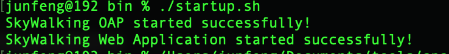
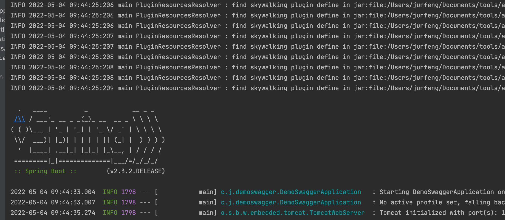
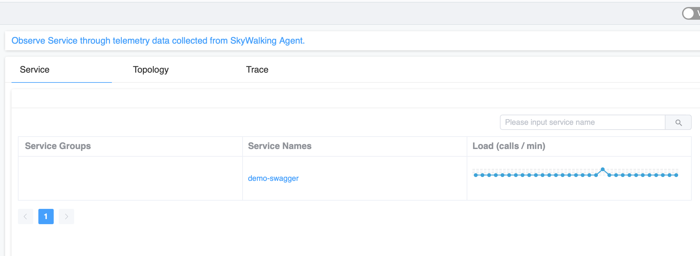

# 链路跟踪skywalking使用


### 1、下载apm

https://www.apache.org/dyn/closer.cgi/skywalking/9.0.0/apache-skywalking-apm-9.0.0.tar.gz


### 2、下载Java agent

https://www.apache.org/dyn/closer.cgi/skywalking/java-agent/8.10.0/apache-skywalking-java-agent-8.10.0.tgz


### 3、解压apm和agent、并将agent放到apm项目中


### 4、启动apm

```shell
cd /Users/junfeng/Documents/tools/apache-skywalking-apm/bin
./startup.sh
```



如上图表示启动成功。


### 5、idea启动java项目的时候注入agent

```
-javaagent:/Users/junfeng/Documents/tools/apache-skywalking-apm/skywalking-agent/skywalking-agent.jar  -Dskywalking.agent.service_name=demo-swagger
```



如上图表示正常启动。


### 6、查看apm后台地址

http://localhost:8080




### 其他

官网地址：

https://skywalking.apache.org

agent文档：

https://skywalking.apache.org/docs/skywalking-java/latest/en/setup/service-agent/java-agent/readme/